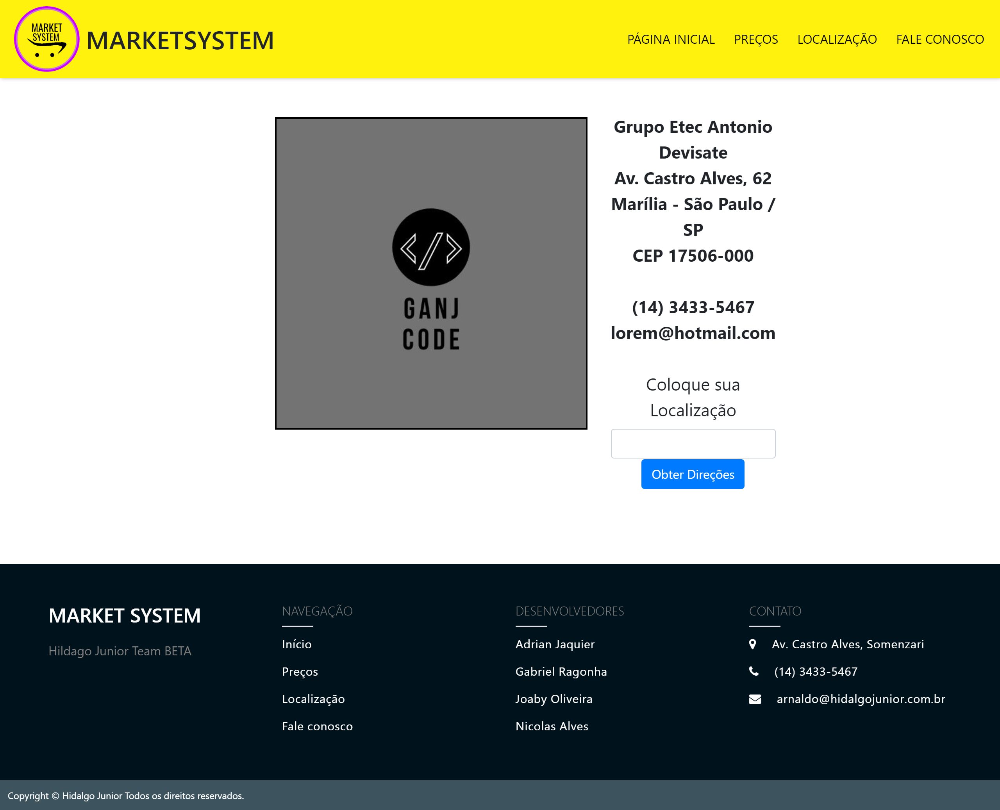
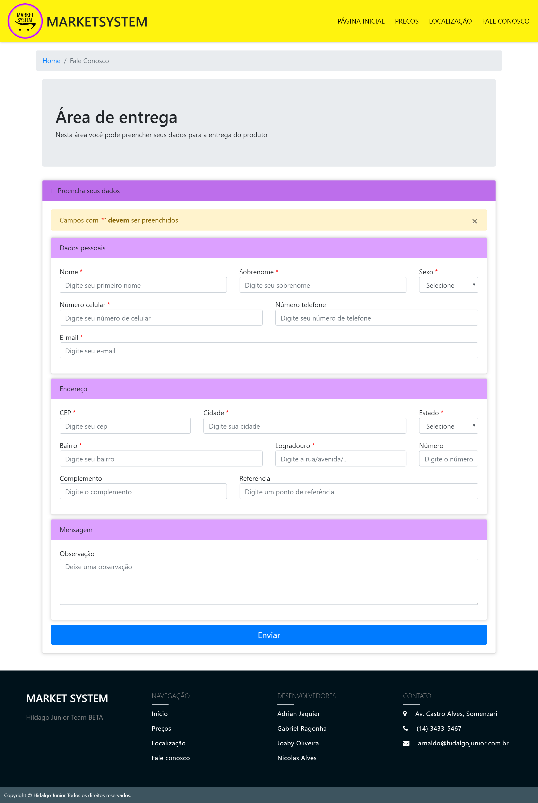

# MarketSystem

## Este projeto é um sistema de uma loja

### Um sistema para facilitar sua vida...

# Paginas do site

# Pagina inicial
> Nesta página inicial existe um slider que mostra os produtos mais vendidos  

>**_Pagina inicial_** (index)

# Preços
> Esta página contém uma grade dos produtos existentes na loja que por sua vez está separada e agrupada por cada categoria, como por exemplo, tablets, smartwatches, etc.

> _Preços_

# Localização
> Esta página contém informações sobre o local onde a loja se encontra e um campo para que nele seja digitado um endereço (endereço do cliente) e então, seja calculada uma rota até a loja, através do google maps

>_Localização_

# Fale conosco 
> Esta página contém um formulário onde o usuário pode preencher seus dados e endereço para que possa ser efetuada a entrega de um determinado produto

> _Fale Conosco_ 

## Sobre
> Este sistema contem um tela inicial que mostra os produtos mais vendidos da loja, alem dessa tela inicial, nele existe uma aba de produtos (preços). Ao clicar em algum dos produtos, você é redirecionado à uma tela onde há informações sobre o produto, tais quais, descrição, foto, preço, cor, etc.
### Como exemplo:   

# Sobre o sistema (código)
> O sistema ainda está em uma fase estática, pois não existe nenhuma linguagem de programação presente, _(exceto um único elemento bootstrap js do carousel na pagina inicial)_. O site tem a maior parte feita usando Bootstrap 4, e algumas paginas têm predominância de css e html puros. Este sistema está em desenvolvimento e aguarda receber grandes atualizações.

|Composição do grupo|Emails|
|-----------|-----------|
|[Adrian Jaquier](https://github.com/adrian2004)|adrian.jaquier@etec.sp.gov.br|
|[Gabriel Ragonha](https://github.com/GabrielRagonhaRodrigues)|gabriel.rodrigues313@etec.sp.gov.br|
|[Joaby Oliveira](https://github.com/joaby-oliveira)|joaby.santos@etec.sp.gov.br|
